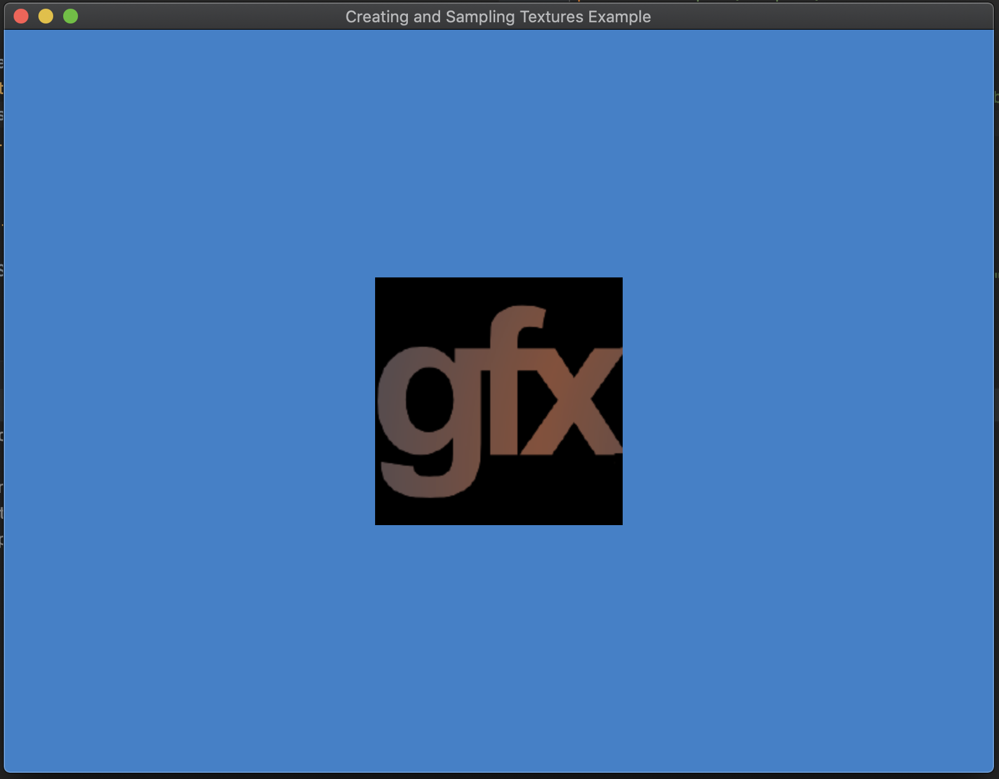

# texture

This tutorial ports the Objective-C/Swift [Creating and Sampling Textures] tutorial to Rust.

We use a [Cargo build script][build-scripts] to:

- Generate Rust types from our metal shader type definitions using [rust-bindgen]
  - The type generation is cached and only happens when the shader type definitions change.

- Compile our shaders into a `metallib`

After the build script runs the `main.rs` binary uses the generated types to pass vertex and texture data to the GPU where we
render a textured quad to a window.

## To Run

```
cargo run -p texture

# If you see an error such as:
#   /Applications/Xcode.app/Contents/Developer/Toolchains/XcodeDefault.xctoolchain/usr/lib/clang/11.0.3/include/avx512vlcdintrin.h:49:10: error: invalid conversion between vector type '__m128i' (vector of 2 'long long' values) and integer type 'int' of different size, err: true
#
# Try linking to LLVM's clang instead of Apple's:
#   brew install llvm
#   LIBCLANG_PATH=/usr/local/opt/llvm/lib cargo run -p texture
```

## Screenshots



[rust-bindgen]: https://github.com/rust-lang/rust-bindgen
[build-scripts]: https://doc.rust-lang.org/cargo/reference/build-scripts.html
[Creating and Sampling Textures]: (https://developer.apple.com/documentation/metal/creating_and_sampling_textures)
