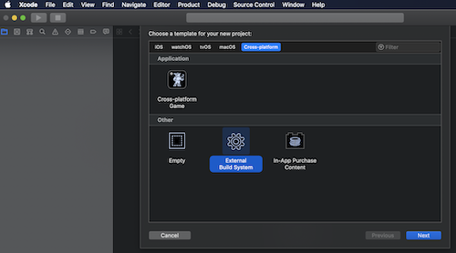
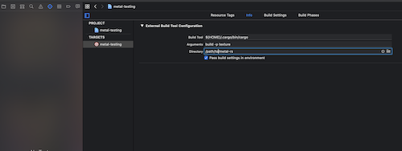
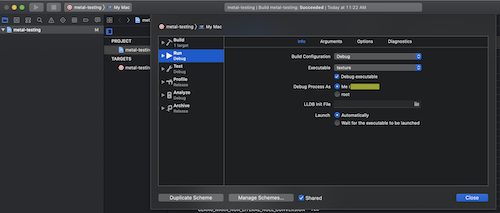
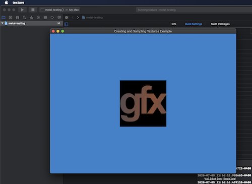
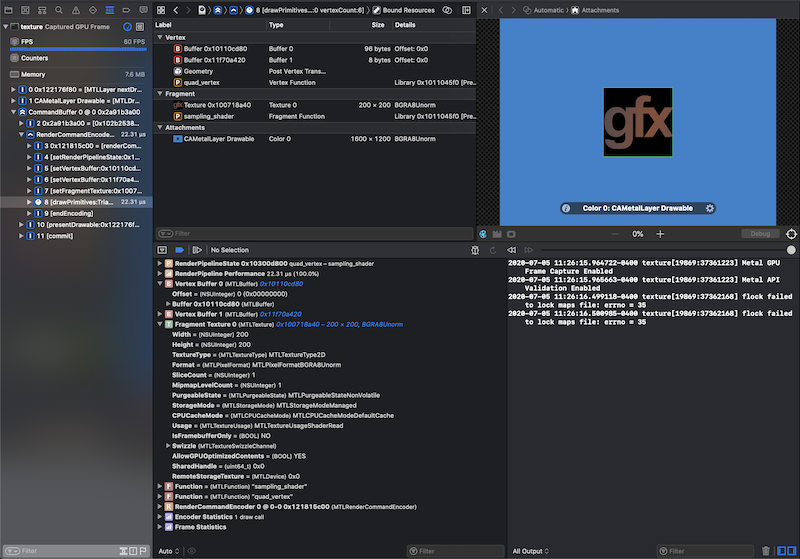

# Saving a GPU trace to a file

GPU command data can be saved to a file using `MTLCaptureManager`. The trace can then be opened and replayed in Xcode at a later time. The following snippet shows how a `CaptureManager` and `CaptureScope` can be used to capture a frame.
```rust
let capture_scope = metal::CaptureManager::shared()
  .new_capture_scope_with_device(&metal::Device::system_default().unwrap());

let capture_descriptor = metal::CaptureDescriptor::new();
capture_descriptor.set_capture_scope(&capture_scope);
capture_descriptor.set_output_url(std::path::Path::new(
  "~/.../.../framecapture.gputrace",
));
capture_descriptor.set_destination(metal::MTLCaptureDestination::GpuTraceDocument);
metal::CaptureManager::shared().start_capture(&capture_descriptor);

capture_scope.begin_scope();
// Do Metal work
capture_scope.end_scope();
```

> **Warning**
> To capture a GPU trace to a file, you must:
> - Set `METAL_CAPTURE_ENABLED=1` in the environment, or add an `info.plist` containing the `MetalCaptureEnabled` key with a value of `YES`.
> - Ensure the capture descriptor output URL does not already exist.

# Debugging in Xcode

If you only want to enable Metal validation without using Xcode, use the `METAL_DEVICE_WRAPPER_TYPE=1` environment variable when lauching your program. For example, to run the `window` example with Metal validation, use the command `METAL_DEVICE_WRAPPER_TYPE=1 cargo run --example window`.

Let's walk through an example of debugging the [`texture` example](/examples/texture).

---

Create a new project using the "External Build System" template.



---


Set the build command to be `cargo` and set the working directory to be the `metal-rs` repository.

Set the arguments to `build --package texture`



---

Click `build` once in order to generate the executable.

> If you get any shader compilation errors edit your `Build Settings` with `LIBCLANG_PATH=/usr/local/opt/llvm/lib` after running `brew install llvm`.

`Product > Scheme > Edit Scheme` and choose the `metal-rs/target/texture` executable.



---

Now when you click `run` you should see the textured quad example in a window.



---

From here you'll be able to use XCode's Metal debugging tools on your running application, such as capturing a GPU frame.



---

See [Developing and debugging shaders](https://developer.apple.com/documentation/metal/shader_authoring/developing_and_debugging_metal_shaders) for more infromation on
debugging Metal applications in XCode.

# Capture GPU Command Data to a File

You can also [capture GPU command data programatically](https://developer.apple.com/documentation/metal/frame_capture_debugging_tools/capturing_gpu_command_data_programmatically). 

Note that Xcode has a closed source approach to how it sets the `GT_HOST_URL_MTL` environment variable that is required for captures, so you must run your application within Xcode in order to use the frame capture debugging tools.
